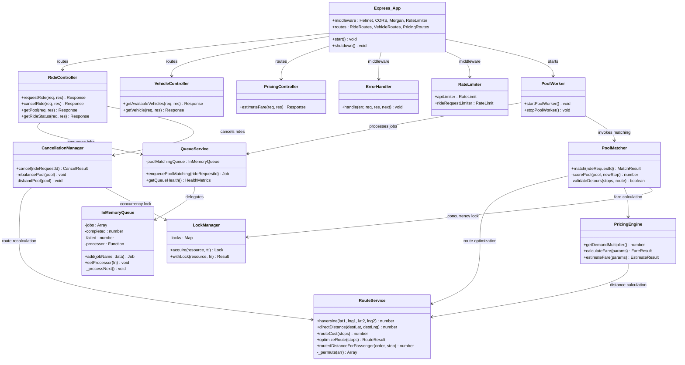
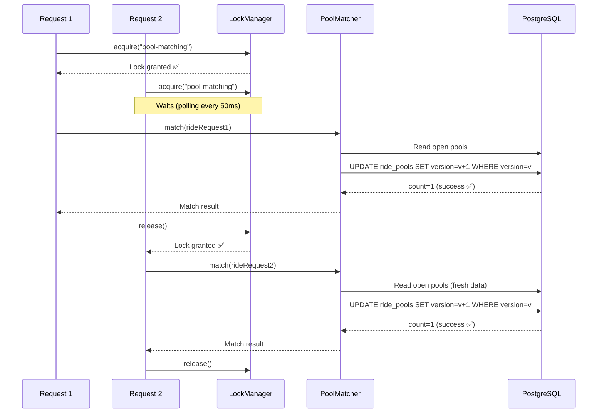
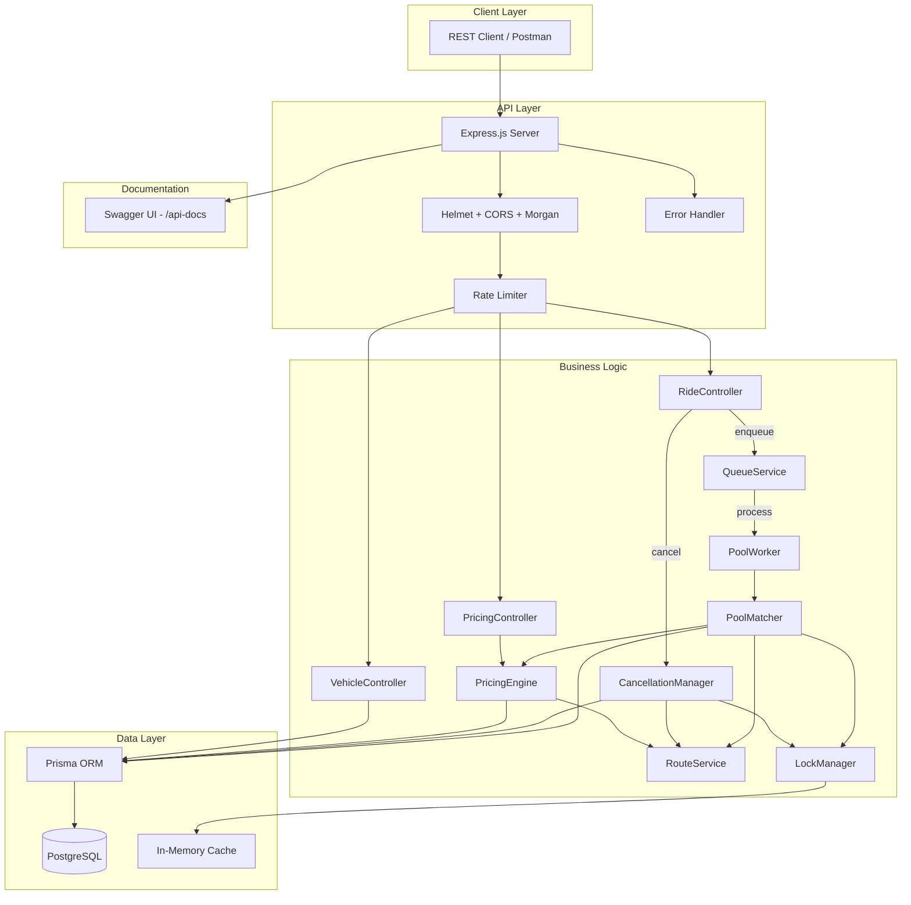

# 📐 Low-Level Design — Smart Airport Ride Pooling

---

## Table of Contents

- [Class Diagram](#class-diagram)
- [Design Patterns](#design-patterns)
- [DSA Approach & Complexity Analysis](#dsa-approach--complexity-analysis)
- [Concurrency Model](#concurrency-model)
- [Database Indexing Strategy](#database-indexing-strategy)
- [High-Level Architecture](#high-level-architecture)

---

## Class Diagram



---

## Design Patterns

### 1. Singleton Pattern
**Used in:** `LockManager`, `QueueService`, `PrismaClient`

```javascript
// lock-manager.js — exports a singleton instance
module.exports = new LockManager();
```

**Why:** Ensures a single shared lock table and queue across the entire application — critical for concurrency correctness.

### 2. Producer-Consumer Pattern
**Used in:** `QueueService` (producer) + `PoolWorker` (consumer)

```
RideController → QueueService.enqueue()  →  InMemoryQueue  →  PoolWorker → PoolMatcher.match()
   (Producer)        (Buffer)                 (Queue)          (Consumer)     (Processor)
```

**Why:** Decouples ride request creation from the computationally expensive pool matching. Allows async processing, retry logic, and backpressure handling.

### 3. Strategy Pattern (Implicit)
**Used in:** `PricingEngine.calculateFare()`

The pricing formula components (base fare, distance rate, demand multiplier, pool discount, detour penalty) are all configurable via environment variables. Different pricing strategies can be achieved by changing configuration without modifying code.

### 4. Mutex / Distributed Lock Pattern
**Used in:** `LockManager.withLock()`

```javascript
async withLock(resource, fn, ttl = 5000) {
    const lock = await this.acquire(resource, ttl);
    try {
        return await fn();
    } finally {
        await lock.release();  // Always released
    }
}
```

**Why:** Prevents race conditions when multiple requests try to modify the same pool simultaneously.

### 5. Optimistic Locking Pattern
**Used in:** `PoolMatcher.match()` on the `RidePool.version` column

```javascript
const updateResult = await prisma.ridePool.updateMany({
    where: { id: poolId, version: currentVersion },  // If changed, count = 0 → retry
    data: { version: currentVersion + 1, ... }
});
if (updateResult.count === 0) throw new Error('Optimistic lock conflict');
```

**Why:** Second layer of defense. If two requests somehow bypass the mutex (e.g., in a multi-instance production deployment), the version check catches the conflict.

### 6. Template Method Pattern
**Used in:** `CancellationManager.cancel()`

The cancel flow follows a fixed sequence: validate → cancel request → remove from pool → rebalance OR disband. Sub-steps (rebalance vs disband) vary based on remaining passenger count.

---

## DSA Approach & Complexity Analysis

### 1. Haversine Distance (RouteService.haversine)

**Problem:** Calculate great-circle distance between two GPS coordinates.

**Formula:**
```
a = sin²(Δlat/2) + cos(lat₁) × cos(lat₂) × sin²(Δlng/2)
distance = 2 × R × arcsin(√a)
```

| Metric | Value |
|--------|-------|
| Time | O(1) |
| Space | O(1) |

### 2. Route Optimization (RouteService.optimizeRoute)

**Problem:** Find the ordering of N drop-off stops (starting from airport) that minimizes total route cost.

**Approach:** Brute-force permutation — generate all N! orderings, compute cost for each, return minimum.

**Why brute-force?** With max 4 passengers per pool, N! = 24 permutations. This is trivially fast and guarantees the global optimum. More complex algorithms (Held-Karp, branch & bound) are unnecessary at this scale.

| Metric | Value |
|--------|-------|
| Time | O(N! × N) where N ≤ 4 → O(24 × 4) = O(96) |
| Space | O(N! × N) for storing permutations |
| Worst-case wall time | < 1ms |

### 3. Pool Matching (PoolMatcher.match)

**Problem:** Given a new ride request, find the best existing pool or create a new one.

**Algorithm:** Greedy Incremental Insertion
```
1. Fetch all OPEN pools (P pools)
2. For each pool:
   a. Check seat capacity         → O(1)
   b. Check luggage capacity      → O(1)
   c. Compute current route cost  → O(N!)   where N = current passengers
   d. Simulate adding new stop    → O((N+1)!)
   e. Validate all detour ratios  → O(N+1)
   f. Compute score               → O(1)
3. Pick pool with lowest score    → O(P)
4. Update DB with optimistic lock → O(1) DB ops
```

| Metric | Value |
|--------|-------|
| Time | O(P × N!) where P = open pools, N ≤ 4 |
| Effective | O(P × 24) |
| Space | O(P) |
| Target latency | < 300ms |

### 4. Cancellation Rebalancing (CancellationManager.cancel)

**Problem:** Remove a passenger from a pool and recalculate the optimal route.

| Metric | Value |
|--------|-------|
| Time | O((N-1)!) for route re-optimization + O(N) for pickup reordering |
| Space | O(N) |

### 5. Dynamic Pricing (PricingEngine.calculateFare)

**Formula:**
```
Price = (BaseFare + DistanceRate × Distance) × DemandMultiplier
        − PoolDiscount + DetourPenalty

Where:
  DemandMultiplier = min(1.0 + (pending/available)/3 × (maxMultiplier - 1), maxMultiplier)
  PoolDiscount     = subtotal × discountPercent / 100  (if pooled)
  DetourPenalty    = penaltyRate × detourKm
```

| Metric | Value |
|--------|-------|
| Time | O(1) + 2 DB count queries |
| Space | O(1) |

---

## Concurrency Model

### Two-Layer Protection



**Layer 1 — Mutex Lock:** Serializes pool matching operations. Only one match() runs at a time. Prevents concurrent reads of stale pool state.

**Layer 2 — Optimistic Locking:** Version column on `ride_pools`. Even if the mutex is bypassed (e.g. multi-instance deployment), the `WHERE version = N` clause ensures no conflicting updates.

**TTL Safety Net:** Locks auto-release after 5000ms to prevent deadlocks from crashes.

---

## Database Indexing Strategy

### Indexes and Rationale

| Table | Index | Column(s) | Why |
|-------|-------|-----------|-----|
| `vehicles` | `idx_vehicles_status` | `status` | Pool matcher queries `WHERE status = 'AVAILABLE'` on every match. High cardinality filter (3 enum values). |
| `ride_pools` | `idx_ride_pools_status` | `status` | Pool matcher queries `WHERE status = 'OPEN'` on every match. Critical hot path. |
| `ride_pools` | `idx_ride_pools_vehicle` | `vehicle_id` | FK lookups when fetching pool details with vehicle join. |
| `ride_requests` | `idx_ride_requests_status` | `status` | Pricing engine counts `WHERE status = 'PENDING'` for demand multiplier. Also used for cancellation queries. |
| `ride_requests` | `idx_ride_requests_pool` | `pool_id` | Join queries when fetching all passengers in a pool. Used in matching and pool detail endpoints. |
| `ride_requests` | `idx_ride_requests_passenger` | `passenger_id` | Lookup rides by passenger. Supports future "my rides" queries. |
| `pool_passengers` | `idx_pool_passengers_pool` | `pool_id` | Join on pool details with ordered pickup sequence. |
| `pool_passengers` | `unique_pool_request` | `(pool_id, ride_request_id)` | Composite unique constraint prevents duplicate assignments. |

### Why Not More Indexes?

- Tables are write-heavy during matching (INSERT + UPDATE per match). Too many indexes slow writes.
- Current indexes target the **hot path** (matching algorithm) and **critical queries** (status lookups, FK joins).
- No full-text search or range queries needed — simple equality filters suffice.

---

## High-Level Architecture



---

## Scalability Notes

| Concern | Current (Local) | Production Upgrade |
|---------|----------------|-------------------|
| Queue | In-memory async queue | BullMQ + Redis |
| Locking | In-memory mutex | Redlock + Redis cluster |
| Cache | In-memory Map | Redis with TTL |
| Database | Single PostgreSQL | Read replicas + connection pooling |
| Deployment | Single process | K8s with horizontal pod autoscaling |
| Monitoring | Console logs | Prometheus + Grafana |
